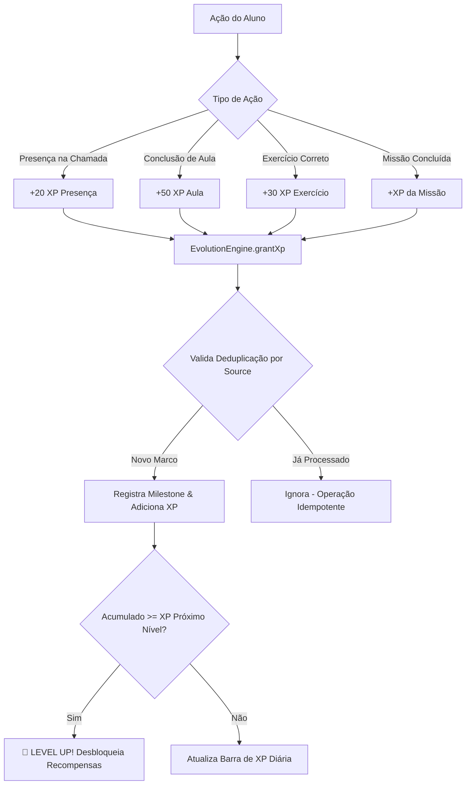
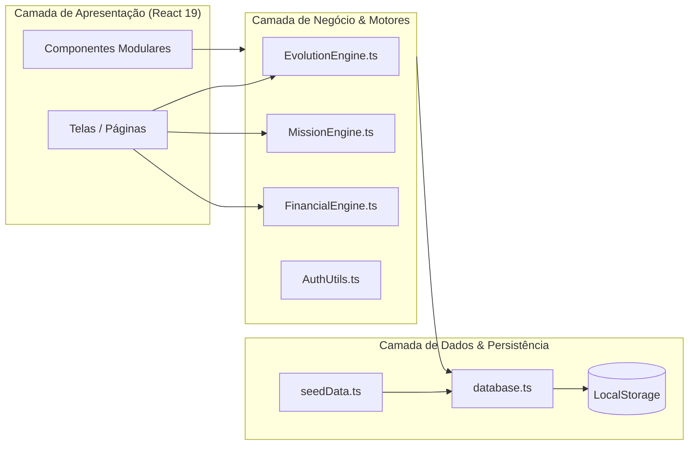

<h1 align="center">⚔️ EducaGameEvolui 🎓</h1>

<h3 align="center">
  Plataforma de Ensino & ERP Escolar Gamificado com Motor de RPG
</h3>

<p align="center">
  Uma solução educacional completa que une a rotina administrativa e pedagógica de uma escola real (frequência, notas, financeiro, comunicação e matrícula) a uma jornada gamificada imersiva baseada em RPG para engajamento contínuo de alunos, professores e famílias.
</p>

<p align="center">
  <a href="https://react.dev/"></a>
  <a href="https://www.typescriptlang.org/"></a>
  <a href="https://vitejs.dev/"></a>
  <a href="https://lucide.dev/"></a>
  
  
</p>

---

> [!TIP]
> **Arquitetura 100% Client-Side:** O EducaGameEvolui roda inteiramente no navegador como uma SPA React/TypeScript com persistência reativa no `localStorage` via `database.ts` — sem necessidade de configurar servidores ou bancos de dados externos para demonstração imediata.

> [!IMPORTANT]
> **Base de Requisitos Oficial:** Toda a implementação foi auditada e construída com base no **BLUEPRINT MASTER — Documento 000 — Constituição do Projeto** (`docs/blueprint/Construcao_do_Projeto_Educacional_Primeira_Etapa.pdf`) e no sistema de regras do **Blue Phoenix RPG**.

---

## 📌 Sumário

- [✨ Principais Funcionalidades](#-principais-funcionalidades)
- [🧩 Matriz de Entregas (Fase 0 + Fase 1 MVP)](#-matriz-de-entregas-fase-0--fase-1-mvp)
- [👥 Papéis e Permissões do Sistema (RBAC)](#-papéis-e-permissões-do-sistema-rbac)
- [⚔️ O Motor de Evolução RPG](#️-o-motor-de-evolução-rpg)
- [🏗 Arquitetura do Sistema](#-arquitetura-do-sistema)
- [🚀 Como Executar o Projeto](#-como-executar-o-projeto)
- [📁 Estrutura de Arquivos](#-estrutura-de-arquivos)
- [📚 Documentação Técnica](#-documentação-técnica)

---

## ✨ Principais Funcionalidades

### 🎓 Para o Estudante
- **Jornada de Aprendizado Gamificada:** Ganhe XP ao assistir aulas, realizar exercícios e manter uma frequência regular.
- **Evolução de Personagem & Duplo Gênero:** Suba de nível, escolha entre **11 Classes RPG** com nomenclaturas e avatares ajustados ao gênero (♂/♀) em Pixel Art (Guerreiro/Guerreira, Rei/Rainha, Dobrador/Dobradora de Fogo, etc.).
- **Quadro de Missões:** Missões Comuns (turma toda), Requisitadas (específicas) e Blitz (conclusão rápida), com bônus por cumprimento semanal.
- **Árvore de Habilidades & Chefe de Turma:** Desbloqueie habilidades na Skill Tree e participe de batalhas colaborativas contra Chefes de Turma baseadas no progresso acadêmico coletivo.
- **Manual Pedagógico da Gameficação:** Manual completo disponível para todos os alunos explicando como a gamificação desenvolve competências para futuras carreiras (DevOps, QA, Inovação, Lógica e Gestão).

### 🏫 Marca da Escola Contratante (White-Label Branding)
- **Identidade da Instituição:** Personalização em tempo real do Nome da Escola e URL/Caminho da Logomarca através do Painel de Manutenção.
- **Adaptação Total:** Exibição da marca da escola na tela de Login, no Cabeçalho Superior (`Header`) e na Barra Lateral (`Sidebar`).

### 📱 Menu Lateral Responsivo & Ajustável (`Sidebar`)
- **Menu Expansível (290px) e Colapsável (80px):** Alternância com 1 clique para o Modo Apenas Ícones.
- **Tooltips Flutuantes no Hover:** Exibição instantânea do nome da seção ao passar o mouse sobre os ícones no menu recolhido.
- **Persistência de Preferência:** O estado do menu é memorizado no navegador (`localStorage`).

### 👨‍🏫 Para o Instrutor / Professor (Mestre de Jogo)
- **Diário de Classe & Chamada:** Registro fácil de presença/falta da turma com concessão automática e **idempotente** de 20 XP por presença confirmada.
- **Gestor de Missões:** Criação e publicação de missões com prazos e recompensas em XP, além de uma **Fila de Validação** de evidências para Missões de Herói.
- **Assistente de Aula Integrado:** Geração local de rascunhos pedagógicos e planos de aula no `CourseEditor` usando templates inteligentes (ADR 0002).
- **Comunicação com a Família:** Canal de mensagens diretas e publicação de avisos direcionados por turma.

### 👨‍👩‍👧 Para a Família (Responsável)
- **Portal da Família:** Visão exclusiva do(s) dependente(s) vinculado(s) via `GuardianLink`.
- **Acompanhamento 360°:** Acesso em modo somente-leitura às notas, histórico de frequência diária, progresso RPG e extrato de mensalidades.
- **Alternância Multidirecional:** Alternância simples entre múltiplos filhos em uma única conta de responsável.

### ⚙️ Para a Administração Escolar
- **Gestão Completa de Usuários:** Cadastro estendido com matrícula, data de nascimento, telefone, responsável e definição de senhas.
- **Edição Reativa de Perfil:** Alteração imediata de cargos, turmas, gênero RPG e avatares sem necessidade de recarregar a página.
- **Financeiro Básico:** Lançamento de faturas/mensalidades, baixa manual de pagamento e recalculo automático do status atrasado (`OVERDUE`).
- **Avisos Globais:** Publicação de comunicados direcionados a toda a escola (`SCHOOL`) ou turmas específicas (`schoolClass`).

---

## 🧩 Matriz de Entregas (Fase 0 + Fase 1 MVP)

| Entrega | Módulo | Descrição Resumida | Componentes / Código Principal | Status |
|:---:|:---|:---|:---|:---:|
| **A** | **Cadastro Estendido** | Matrícula, nascimento, responsável e telefone no `User`. | `UserManagement.tsx`, `types/index.ts` | ✅ |
| **B** | **Turmas & Chamada** | Chamada do dia com concede idempotente de 20 XP por presença. | `Attendance.tsx`, `EvolutionEngine.ts` | ✅ |
| **C** | **Motor de Missões** | Missões Comuns, Requisitadas, Blitz e Herói + Fila de Aprovação. | `MissionEngine.ts`, `MissionBoard.tsx` | ✅ |
| **D** | **Assistente de Aula** | Gerador local de rascunhos de aulas no Editor de Cursos. | `CourseEditor.tsx`, `ADR 0002` | ✅ |
| **E** | **Portal da Família** | Painel do Responsável com visão leitura de notas, presença e RPG. | `FamilyPortal.tsx`, `database.ts` | ✅ |
| **F** | **Financeiro Básico** | Lançamento de mensalidades e cálculo dinâmico de status vencido. | `Financial.tsx`, `FinancialEngine.ts` | ✅ |
| **G** | **Comunicação** | Mural de avisos por turma/escola e mensagens diretas. | `AnnouncementBoard.tsx`, `DirectMessaging.tsx` | ✅ |
| **H** | **Onboarding** | Modal de tutorial, escolha de avatar e missão de boas-vindas. | `OnboardingModal.tsx`, `CharacterCreator.tsx` | ✅ |
| **I** | **Autenticação Real** | Tela de login por e-mail/senha com hashing SHA-256 client-side. | `AuthUtils.ts`, `Login.tsx` | ✅ |

---

## 👥 Papéis e Permissões do Sistema (RBAC)

| Funcionalidade / Tela | `STUDENT` | `INSTRUCTOR` | `GUARDIAN` | `ADMIN` | `MAINTENANCE` |
|:---|:---:|:---:|:---:|:---:|:---:|
| Cursos & Aulas | 👁️ Visualiza / Cursa | ✏️ Edita / Cria | ❌ | ✏️ Total | 👁️ Leitura |
| Diário de Chamada | 👁️ Apenas Frequência | ✍️ Registra | 👁️ Apenas Frequência | ✍️ Total | 👁️ Leitura |
| Criador de Missões | ❌ | ✍️ Registra | ❌ | ✍️ Total | 👁️ Leitura |
| Quadro de Missões | 🎮 Realiza / Envia | 👁️ Fila Validação | ❌ | 👁️ Leitura | 👁️ Leitura |
| Boletim & Notas | 👁️ Próprias Notas | ✍️ Lança Notas | 👁️ Notas do Filho | ✍️ Total | 👁️ Leitura |
| Extrato Financeiro | ❌ | ❌ | 👁️ Leitura do Filho | ✍️ Lança / Baixa | 👁️ Leitura |
| Portal da Família | ❌ | ❌ | 👁️ Acesso Total | 👁️ Leitura | 👁️ Leitura |
| Mensagens Diretas | ❌ | 💬 Envia/Recebe | 💬 Envia/Recebe | 👁️ Leitura | 👁️ Leitura |
| Gestão de Usuários | ❌ | ❌ | ❌ | ⚙️ Total | ⚙️ Total |

---

## ⚔️ O Motor de Evolução RPG

O `EvolutionEngine` garante um ecossistema de gamificação equilibrado e transparente:



### Tabela de Recompensas por Hábito

| Hábito / Ação | Recompensa de XP | Tipo de Marco | Regra Especial |
|:---|:---:|:---:|:---|
| **Presença na Chamada** | `20 XP` | Marco Pessoal | Limitado a 1x por dia/aluno (Regra B1). |
| **Login Diário** | `10 XP` | Marco Pessoal | Concedido no primeiro acesso do dia. |
| **Streak de 7 Dias** | `200 XP` | Marco Pessoal | Concedido ao atingir 7 dias consecutivos. |
| **Streak de 30 Dias** | `500 XP` | Marco Pessoal | Concedido ao atingir 30 dias consecutivos. |
| **Missão de Herói** | Varia (ex: `150 XP`) | Marco de Herói | Requer aprovação do professor na fila. |
| **Bônus Semanal** | `+50% XP` acumulado | Marco de Herói | Concedido ao concluir todas as Comuns da semana. |

---

## 🏗 Arquitetura do Sistema

A aplicação adota o padrão de arquitetura desacoplada em camadas no frontend:



---

## 🚀 Como Executar o Projeto

### Pré-requisitos
- **Node.js** `>= 18.0.0`
- **npm** `>= 9.0.0`

### 1. Clonar e Instalar
```bash
# Clone o repositório
git clone https://github.com/naiffnet/EducaGameEvolui.git

# Acesse o diretório
cd EducaGameEvolui

# Instale as dependências
npm install
```

### 2. Rodar em Ambiente de Desenvolvimento
```bash
npm run dev
```
Abra o seu navegador em `http://localhost:5173`.

### 3. Validação de Tipos (TypeScript)
```bash
npx tsc -b --noEmit
```

### 4. Build de Produção
```bash
npm run build
```

---

## 📁 Estrutura de Arquivos

```
EducaGameEvolui/
├── docs/                        # Documentação técnica complementar
│   ├── adr/                     # Architectural Decision Records (ADRs)
│   └── blueprint/               # Documento BLUEPRINT MASTER de referência
├── src/
│   ├── components/              # Componentes React reutilizáveis
│   │   ├── AnnouncementBoard.tsx # Mural de avisos
│   │   ├── DirectMessaging.tsx   # Mensagens diretas
│   │   ├── MissionBoard.tsx      # Quadro de missões do aluno
│   │   ├── OnboardingModal.tsx   # Modal de tutorial do aluno
│   │   ├── CharacterCreator.tsx  # Criador/seletor de avatar
│   │   └── ...
│   ├── context/                 # Contextos React (AuthContext)
│   ├── db/                      # Camada de banco de dados client-side
│   │   ├── database.ts          # Gerenciador de estado local e coleções
│   │   └── seedData.ts          # Dados semente iniciais
│   ├── engine/                  # Motores de regra puras de negócio
│   │   ├── EvolutionEngine.ts   # Motor de RPG, Níveis e XP
│   │   ├── MissionEngine.ts     # Motor de Missões e entregas
│   │   ├── FinancialEngine.ts   # Motor de cálculo financeiro
│   │   └── AuthUtils.ts         # Utilitário de hash SHA-256
│   ├── pages/                   # Telas principais organizadas por perfil
│   │   ├── Admin/               # Gestão de Usuários e Financeiro
│   │   ├── Guardian/            # Portal da Família
│   │   ├── Instructor/          # Chamada, Missões e Assistente de Aula
│   │   └── Student/             # Dashboard do Aluno, Cursos e Exercícios
│   ├── types/                   # Tipos e interfaces TypeScript (index.ts)
│   ├── App.tsx                  # Roteador central e layout
│   └── main.tsx                 # Ponto de entrada React
├── PLANO_IMPLEMENTACAO.md       # Plano de implementação unificado mestre
├── UBIQUITOUS_LANGUAGE.md       # Glossário oficial de termos de domínio
├── SPEC.md                      # Especificação de alinhamento do motor RPG
├── tasks.md                     # Checklist de status de execução
├── package.json                 # Dependências e scripts
└── vite.config.ts               # Configuração do Vite
```

---

## 📚 Documentação Técnica

Consulte a documentação detalhada inclusa no repositório:

- 📑 **[Plano de Implementação Mestre (`PLANO_IMPLEMENTACAO.md`)](PLANO_IMPLEMENTACAO.md)** — Consolidação de todas as 9 entregas, 40 User Stories e matriz de auditoria do Blueprint.
- 📖 **[Linguagem Ubíqua (`UBIQUITOUS_LANGUAGE.md`)](UBIQUITOUS_LANGUAGE.md)** — Glossário formal dos termos de domínio do projeto.
- 📊 **[Checklist de Implementação (`tasks.md`)](tasks.md)** — Roteiro de tarefas concluídas por entrega.
- ⚙️ **[Especificação de Correções (`SPEC.md`)](SPEC.md)** — Registro do alinhamento do motor de evolução RPG ao domínio.
- 💡 **[ADR 0002 — Assistente de Aula](docs/adr/0002-assistente-de-aula-nao-chama-llm-do-cliente.md)** — Decisão técnica sobre a geração local de rascunhos de aulas sem exposição de chaves de API.

---

<p align="center">
  <sub>EducaGameEvolui — Transformando o aprendizado em uma jornada extraordinária.</sub>
</p>
